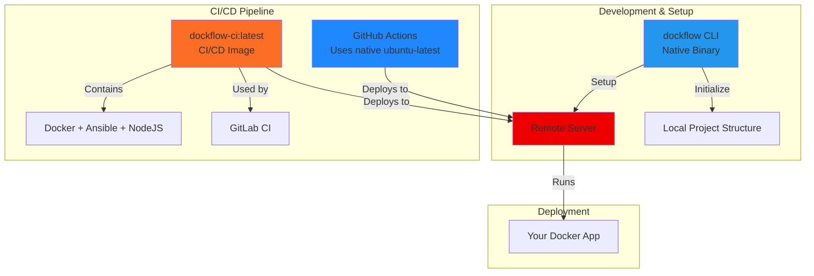

# Contributing Guide

Welcome! Contributions are appreciated. Open an issue or pull request to suggest features or improvements.

## Architecture Overview

Dockflow uses a native CLI binary and a Docker image for CI/CD:



| Component | Purpose | Description |
|-----------|---------|-------------|
| **dockflow CLI** | Machine setup & project initialization | Native binary (Linux, macOS, Windows) |
| **dockflow-ci** | GitLab CI/CD deployments | Docker image with Ansible, NodeJS |

> **Note:** GitHub Actions uses `ubuntu-latest` which already includes required tools.

---

## Before Contributing

**Run E2E tests** before submitting a PR → See [Developer Guide](./DEVELOPERS.md)

**Use version management scripts** when bumping versions to maintain consistency across all project files (CI configs, examples, Docker images). See [Version Management](#version-management) section.

---

## Building CLI Binaries

The CLI is built as a native binary using Bun. See the `cli-ts/` directory for the TypeScript source.

### Prerequisites

- [Bun](https://bun.sh) v1.1+ installed

### Build Commands

```bash
cd cli-ts

# Install dependencies
bun install

# Build all platform binaries
bun run build

# Build for a specific platform
bun run build linux-x64
```

### Output

Binaries are generated in `cli-ts/dist/`:

| Binary | Platform |
|--------|----------|
| `dockflow-linux-x64` | Linux (x64) |
| `dockflow-linux-arm64` | Linux (ARM64) |
| `dockflow-windows-x64.exe` | Windows (x64) |
| `dockflow-macos-x64` | macOS (Intel) |
| `dockflow-macos-arm64` | macOS (Apple Silicon) |

### Development

Run the CLI without compilation:

```bash
bun ./cli-ts/src/index.ts --help
bun ./cli-ts/src/index.ts setup interactive
```

#### Testing deploy/build with local Dockflow

Use the dev script to test deployment with your local Dockflow changes. The script automatically:
- Sets `DOCKFLOW_DEV_PATH` to the project root
- Adds `--dev` flag for deploy/build commands

```bash
# From your project directory (e.g., my-app/)
cd /path/to/my-app

# Run dockflow commands using the dev script
bun /path/to/dockflow/cli-ts/scripts/dev.ts deploy production --force
bun /path/to/dockflow/cli-ts/scripts/dev.ts build production
```

**Recommended: Create an alias for convenience**

```bash
# Bash/Linux/macOS - Add to ~/.bashrc or ~/.zshrc
alias dockflow-dev='bun /path/to/dockflow/cli-ts/scripts/dev.ts'
```

```powershell
# PowerShell/Windows - Add to $PROFILE
function dockflow-dev { bun C:\path\to\dockflow\cli-ts\scripts\dev.ts @args }
```

Then use it like the regular CLI:

```bash
dockflow-dev deploy production --force
dockflow-dev build production
dockflow-dev ssh production "docker ps"
```

### Releasing CLI Binaries

GitHub Actions automatically builds and publishes binaries when you push a tag matching `cli/*`:

```bash
# Create a new CLI release
git tag cli/1.0.0
git push origin cli/1.0.0
```

This will:
1. Build binaries for all platforms
2. Create a GitHub Release named "Dockflow CLI v1.0.0"
3. Attach all binaries with installation instructions

Download releases from the [Releases page](https://github.com/Shawiizz/dockflow/releases).

---

## Building CI Image

```bash
# Build
docker build --no-cache -t shawiizz/dockflow-ci:X.Y.Z -f Dockerfile.ci .

# Publish
docker login
docker tag shawiizz/dockflow-ci:X.Y.Z shawiizz/dockflow-ci:latest
docker push shawiizz/dockflow-ci:X.Y.Z
docker push shawiizz/dockflow-ci:latest
```

---

## Version Management

Automated scripts handle version updates across all files.

### Commands

**Framework versions:**
```bash
npm run version:dev        # Add/increment dev version (1.0.33 → 1.0.33-dev1)
npm run version:release    # Create release (1.0.33-dev1 → 1.0.34)
npm run version:downgrade  # Decrement version
```

**CI image versions:**
```bash
npm run ci-image:dev        # Add/increment dev version
npm run ci-image:release    # Create release version
npm run ci-image:downgrade  # Decrement version
```

### What Gets Updated

| Type | Files Updated |
|------|---------------|
| **Framework** | `package.json`, CI/CD configs (`*.yml`), example files |
| **CI Image** | `package.json` (ciImageVersion), Docker image references |

---

## Creating New Releases

```bash
# 1. Update versions
npm run version:release      # Framework version
npm run ci-image:release     # CI image version (if needed)

# 2. Build and publish Docker images (if needed)
# See "Building Docker Images" section above

# 3. Create and push Git tag
git tag -a X.Y.Z -m "Version X.Y.Z"
git push origin X.Y.Z
```

---

## Cleaning Up Dev Tags

To delete all development tags for a specific version:

```bash
node scripts/delete-dev-tags.js 1.0.48
```

This removes all `1.0.48-dev*` tags locally and remotely.

---

## License

Contributions are licensed under the [MIT License](./LICENSE).