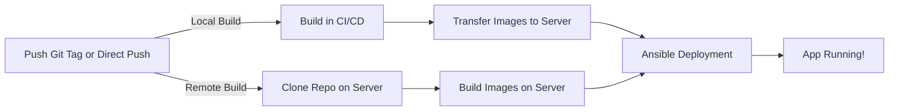

<div align="center">

# Dockflow


**Deploy your Docker apps with a simple `git push` (with or without tags)**

[](https://opensource.org/licenses/MIT)


</div>

---

## What is Dockflow?

A complete framework to **automate Docker deployments** from GitHub/GitLab CI/CD to your servers. 

Push a tag, grab a coffee, and your app is deployed.

> **Beta version** – Production-ready but actively improving. Your feedback is welcome!

### Key Features

- **Multi-environment**: Deploy to production, staging, whatever, etc.
- **Multi-host**: Deploy to multiple servers simultaneously
- **Multi-container**: Handle complex apps with multiple services
- **Secure**: SSH keys and secrets management built-in
- **Flexible builds**: Build in CI/CD or directly on your server
- **Customizable**: Nginx configs, systemd services, custom scripts

### Quick Start

```bash
# 1. Setup your server (one command!)
docker run -it --rm -v ${HOME}/.ssh:/root/.ssh -v .:/project shawiizz/dockflow-cli:latest

# 2. Initialize project structure (CLI is optional)
docker run -it --rm -e HOST_PWD="$(pwd)" -v .:/project shawiizz/dockflow-cli:latest

# 3. Configure your .deployment files
# 4. Add the needed CI secrets
# 5. Push a tag
git tag 1.0.0 && git push origin --tags
```

**That's it!**

---

## Table of Contents

- [How It Works](#how-it-works)
- [Installation](#installation)
- [Configuration](#configuration)
- [Deployment](#deployment)
- [Advanced Usage](#advanced-usage)
- [Examples](#real-world-examples)

---

## How It Works

### The Magic Behind the Scenes



### Deployment Triggers

| Tag Format | Environment | Example |
|------------|-------------|---------|
| `X.Y.Z` | production | `1.0.0` |
| `X.Y.Z-[env]` | custom | `1.0.0-whatever` |
| Branch push | production | Direct push to main |

### Compatible With

- ✅ GitHub Actions
- ✅ GitLab CI

---

## Installation

### Step 1: Server Setup

**Prerequisites:**
- A Debian/Ubuntu server
- Docker Desktop on your local machine

#### Automated Setup (Recommended)

```bash
docker run -it --rm -v ${HOME}/.ssh:/root/.ssh -v .:/project shawiizz/dockflow-cli:latest
```

The CLI will guide you through the setup process interactively.

<details>
<summary>Manual setup (advanced users)</summary>

For manual configuration, check [MANUAL-REMOTE-SETUP.md](./MANUAL-REMOTE-SETUP.md)

</details>

---

### Step 2: CI/CD Configuration

#### 2.1 Create Project Structure

You can use the CLI to automatically generate the project structure:

```bash
# GitHub Actions project
docker run -it --rm -v .:/project shawiizz/dockflow-cli:latest init github

# GitLab CI project
docker run -it --rm -v .:/project shawiizz/dockflow-cli:latest init gitlab
```

This creates the following structure:

```
.deployment/
├── docker/
│   ├── docker-compose.yml           # Define your services
│   └── Dockerfile.[service]         # One per service
├── env/                             # OPTIONAL: Can use CI secrets instead
│   └── .env.[environment]           # OPTIONAL: Environment variables (HOST, USER, etc.)
└── templates/
    ├── nginx/                       # Custom Nginx configs (optional)
    ├── services/                    # Custom systemd services (optional)
    └── scripts/                     # Custom scripts (optional)
```

**Note:** The `env/` folder and `.env` files are optional. You can configure everything using CI secrets with the `[ENV]_*` naming pattern.

#### 2.2 Copy CI Config File

**GitHub Actions:**
```bash
example/ci/github-ci.yml → .github/workflows/deploy.yml
```

**GitLab CI:**
```bash
example/ci/gitlab-ci.yml → .gitlab-ci.yml
```

> ⚠️ **GitHub users in organizations**: Fork this repo and update the `uses` URL in your workflow file.

#### 2.3 Add Repository Secrets

Required secrets in your CI/CD settings:

| Secret Name | Description | Example |
|-------------|-------------|---------|
| `USER` | Remote user name | `dockflow` (default) |
| `USER_PASSWORD` | Remote user password | `your-password` |
| `[ENV]_SSH_PRIVATE_KEY` | SSH key for main host | `PRODUCTION_SSH_PRIVATE_KEY` |
| `[ENV]_[HOSTNAME]_SSH_PRIVATE_KEY` | SSH key for specific host | `PRODUCTION_SERVER_A_SSH_PRIVATE_KEY` |
| `GIT_TOKEN` | OPTIONAL: Remote build option : for private repos | GitHub/GitLab token |

**Dynamic Variable Override System:**

Any CI secret starting with `[ENV]_` or `[ENV]_[HOSTNAME]_` will automatically override corresponding environment variables:

| Pattern | Example Secret | Exported As | Use Case |
|---------|---------------|-------------|----------|
| `[ENV]_*` | `PRODUCTION_HOST` | `HOST` | Override main host variables |
| `[ENV]_*` | `PRODUCTION_USER` | `USER` | Override main host SSH user |
| `[ENV]_*` | `PRODUCTION_DB_PASSWORD` | `DB_PASSWORD` | Override any main host variable |
| `[ENV]_[HOSTNAME]_*` | `PRODUCTION_SERVER_A_HOST` | `HOST` | Override specific host variables |
| `[ENV]_[HOSTNAME]_*` | `PRODUCTION_SERVER_A_API_KEY` | `API_KEY` | Override any specific host variable |

**Important notes:**
- ✅ All secret names must be **UPPERCASE**
- ✅ GitLab secrets must **NOT** be protected
- ✅ Main env file maps to `main` host automatically
- 💡 CI secrets with `[ENV]_` prefix will override values from `.env.[environment]` files
- 💡 CI secrets with `[ENV]_[HOSTNAME]_` prefix will override values from `.env.[environment].[hostname]` files
- 🔒 Use this system to keep sensitive data (passwords, API keys, IPs) out of your repository

<details>
<summary>Git Token Permissions (only for remote build with private repos)</summary>

- **GitHub**: `repo` scope (read access)
- **GitLab**: No token is required, `CI_JOB_TOKEN` variable is automatically used by the CI/CD workflow 

</details>

---

## Configuration

### Environment Files

**Environment files are optional!** You can use CI secrets exclusively or combine them with `.env` files.

Create `.deployment/env/.env.[environment]` with your variables (optional):

```bash
# .env.production
HOST=192.168.1.10              # Can be overridden by PRODUCTION_HOST CI secret
USER=dockflow                  # Can be overridden by PRODUCTION_USER CI secret
DB_PASSWORD=$DB_SECRET         # Reference to CI secret (if you need 1 variable and use it in several envs without duplicating ci secret)
API_PORT=3000                  # Can be overridden by PRODUCTION_API_PORT CI secret
```

**Configuration options:**

1. **CI Secrets Only**: Don't create `.env` files, set all variables as `[ENV]_*` CI secrets
2. **Mixed Approach**: Use `.env` files for non-sensitive data, CI secrets for sensitive values
3. **Environment Files**: Store everything in `.env` files (not recommended for sensitive data)

**Pro tips:** 
- Use `$VARIABLE_NAME` to reference CI secrets directly in `.env` files if you need 1 same secret for several environments
- Any variable can be overridden using `[ENV]_VARIABLE_NAME` CI secrets (e.g., `PRODUCTION_HOST`, `PRODUCTION_API_PORT`)
- For multi-host setups, use `[ENV]_[HOSTNAME]_VARIABLE_NAME` pattern (e.g., `PRODUCTION_SERVER_A_HOST`)
- Keep sensitive data in CI secrets, not in `.env` files committed to the repository
- **Required**: At minimum, `HOST` must be defined (either in `.env` file or as CI secret)
- Default `USER` is called dockflow.

---

### Docker Compose File

Standard compose file with environment variables:

```yaml
services:
  app:
    image: my-app
    build:
      context: ../..
      dockerfile: Dockerfile.app
    ports:
      - "${APP_PORT}:3000"
    environment:
      DB_PASSWORD: ${DB_PASSWORD}
      ENV: ${ENV}
    networks:
      - app-network

networks:
  app-network:
```

**Note:** All files in `.deployment/docker/` (including `docker-compose.yml`, `Dockerfile`, etc.) are automatically processed with Jinja2 templating. You can use `{{ variable_name }}` syntax with any variable from `.env` files or CI secrets (automatically converted to lowercase).

#### Environment Isolation (Automatic)

By default, `${ENV}` and `${VERSION}` are automatically added to:
- Image names
- Container names
- Volume names
- Network names

This ensures **complete isolation** between environments (production, staging, etc.)

**No manual work needed!** Dockflow handles it transparently.

<details>
<summary>Manual environment isolation (advanced)</summary>

If you prefer manual control, create `.deployment/config.yml`:

```yaml
options:
  environmentize: false
```

Then manually add `${ENV}` and `${VERSION}` where needed:

```yaml
services:
  app:
    image: my-app-${ENV}:${VERSION}
    container_name: my-app-${ENV}
    volumes:
      - app-data-${ENV}:/data
    networks:
      - app-network-${ENV}
```

</details>

---

### Build Strategy

Choose how Docker images are built:

| Strategy | Where | Best For | Setup |
|----------|-------|----------|-------|
| **Local** (default) | CI/CD pipeline | Small images, fast network | Nothing to do |
| **Remote** | On server | Large images, slow network | Set `remote_build: true` |

#### Enable Remote Build

Create `.deployment/config.yml`:

```yaml
options:
  remote_build: true
```

**Benefits:**
- Faster deployments
- No CI/CD storage limits
- Reduced bandwidth usage

**Requirements:**
- Docker, Git on remote server
- `GIT_TOKEN` secret for private repos

---

### Multi-Host Deployment

Deploy to multiple servers in the same environment:

```
.deployment/env/
├── .env.production              # Main host
├── .env.production.server-a     # Server A
├── .env.production.server-b     # Server B
└── .env.production.server-c     # Server C
```

**Example:**

```bash
# .env.production (main)
HOST=192.168.1.10
API_PORT=3000
```

```bash
# .env.production.server-a
HOST=192.168.1.11
API_PORT=3001                    # Override main config
REDIS_URL=redis://server-a:6379 # Additional config
```

**Required CI Secrets:**
- `PRODUCTION_SSH_PRIVATE_KEY` (for main host)
- `PRODUCTION_SERVER_A_SSH_PRIVATE_KEY` (for server-a)

**Optional CI Secrets (to override any variable):**
- Main host: `PRODUCTION_*` (e.g., `PRODUCTION_HOST`, `PRODUCTION_USER`, `PRODUCTION_API_PORT`)
- Server A: `PRODUCTION_SERVER_A_*` (e.g., `PRODUCTION_SERVER_A_HOST`, `PRODUCTION_SERVER_A_USER`, `PRODUCTION_SERVER_A_REDIS_URL`)

---

### Configuration File Options

Create `.deployment/config.yml` to customize behavior.

**Important**: The `config.yml` file supports Jinja2 templating, allowing you to use environment variables dynamically:
```yaml
health_checks:
  endpoints:
    - name: "API Health"
      url: "http://localhost:{{ app_external_port }}/health"
```

**Configuration example:**

```yaml
options:
  environmentize: true          # Auto-add ENV/VERSION (default: true)
  enable_debug_logs: false      # Verbose logging (default: false)
  remote_build: false           # Build on server (default: false)

health_checks:
  enabled: true                 # Enable post-deployment health checks
  startup_delay: 15             # Wait before checking (seconds)
  on_failure: "notify"          # Action: "fail", "notify", "ignore" or "rollback"
  
  endpoints:
    - name: "Main Application"
      url: "http://localhost:{{ app_external_port }}/health"
      expected_status: 200
      timeout: 30
      retries: 3
```

#### Configuration Options

| Option | Description | Default |
|--------|-------------|---------|
| `environmentize` | Auto-add `${ENV}` and `${VERSION}` to names | `true` |
| `enable_debug_logs` | Enable detailed Ansible logs | `false` |
| `remote_build` | Build images on remote server | `false` |

#### Health Checks Options

| Option | Description | Default |
|--------|-------------|---------|
| `enabled` | Enable post-deployment health checks | `false` |
| `startup_delay` | Seconds to wait before checking | `10` |
| `on_failure` | Action on failure: `fail` (stop), `notify` (warn), `ignore`, `rollback` (restore previous) | `notify` |

> **Note:** Dockflow health checks are **external** to the containers. They verify service accessibility from the host after deployment. To test inter-container connections (e.g., via custom DNS), use [Docker Compose native health checks](https://docs.docker.com/compose/compose-file/05-services/#healthcheck) directly in your `docker-compose.yml`.

**Health Check Endpoint Properties:**

| Property | Description | Default | Required |
|----------|-------------|---------|----------|
| `name` | Friendly name for the check | URL | No |
| `url` | Endpoint URL to check | - | Yes |
| `method` | HTTP method | `GET` | No |
| `expected_status` | Expected HTTP status code | `200` | No |
| `timeout` | Request timeout in seconds | `30` | No |
| `retries` | Number of retries on failure | `3` | No |
| `retry_delay` | Delay between retries (seconds) | `5` | No |
| `validate_certs` | Validate SSL certificates | `true` | No |

**Example with multiple endpoints:**

```yaml
health_checks:
  enabled: true
  startup_delay: 20
  on_failure: "fail"  # Stop deployment if checks fail
  
  endpoints:
    - name: "API Health"
      url: "http://localhost:3000/health"
      expected_status: 200
      timeout: 30
    
    - name: "Database Connection"
      url: "http://localhost:3000/health/db"
      expected_status: 200
    
    - name: "External Service"
      url: "https://api.example.com/status"
      validate_certs: true
      retries: 5
```

**Automatic Rollback:**

Set `on_failure: "rollback"` to automatically restore previous deployment on health check failure:

```yaml
health_checks:
  enabled: true
  on_failure: "rollback"  # Auto-rollback on failure
  endpoints:
    - name: "Health"
      url: "http://localhost:{{ app_port }}/health"
```

#### Image Management Options

Control how Docker images are managed over time:

| Option | Description | Default |
|--------|-------------|---------|
| `keep_healthy_versions` | Number of successful deployment versions to keep | `1` |
| `cleanup_on_failure` | Remove images immediately on failed deployment | `true` |

```yaml
image_management:
  keep_healthy_versions: 2      # Keep 2 successful versions for quick rollback
  cleanup_on_failure: true      # Clean up failed deployments automatically
```

---

### Advanced: Custom Templates

Add custom configs in `.deployment/templates/`:

```
.deployment/templates/
├── nginx/
│   └── my-app.conf.j2           # Custom Nginx config
├── services/
│   └── my-service.service.j2    # Systemd service
|   └── my-service.mount.j2      # Mount service (sshfs for example. You can also deploy ssh private keys using Dockflow)
└── scripts/
    └── pre-deploy.sh.j2         # Custom script (executed before deploying)
```

All templates support **Jinja2 syntax** and have access to environment variables.

---

## Deployment

### Deploy with Git Tags

```bash
# Production deployment
git tag 1.0.0
git push origin --tags

# Staging deployment
git tag 1.0.0-staging
git push origin --tags

# Custom environment
git tag 1.0.0-whatever
git push origin --tags
```

### Deploy on Branch Push

Before using, you need to configure your Github/GitLab workflow (see example folder).            
You can also trigger deployments on direct branch pushes (deploys to `production`):

```bash
git push origin main
```

### What Happens During Deployment

1. **Build** - Docker images are built (locally or remotely)
2. **Transfer** - Images/code sent to target servers
3. **Deploy** - Ansible orchestrates the deployment
4. **Done** - Your app is live!

**CI/CD Jobs Available:**
- `build` - Validates Docker builds on every push
- `deploy` - Deploys when you push a tag

---

## Advanced Usage

### Custom Nginx Configuration

**Example:** Create `.deployment/templates/nginx/my-app.conf.j2`

```nginx
server {
    listen 80;
    server_name {{ domain }};

    location / {
        proxy_pass http://localhost:{{ app_port }};
        proxy_set_header Host $host;
    }
}
```

---

### Custom Systemd Service

**Example:** Create `.deployment/templates/services/my-worker.service.j2`

```ini
[Unit]
Description={{ service_description }}
After=docker.service

[Service]
Type=simple
ExecStart={{ script_path }}
Environment="ENV={{ env }}"
Restart=always

[Install]
WantedBy=multi-user.target
```

---

### Post-Deployment Scripts

**Example:** Create `.deployment/templates/scripts/cleanup.sh.j2`

```bash
#!/bin/bash
echo "Starting cleanup for {{ env }}..."

# Clean old Docker images
docker image prune -af --filter "until=24h"

echo "Cleanup complete!"
```

All variables from your `.env` files or CI/CD secrets are automatically available in templates. Simply use `{{ variable_name }}` syntax with lowercase variable names.

---

## Real-World Examples

Check out the `example/.deployment/` folder for complete configuration examples.

### Projects Using This Framework

| Project | Description | Link |
|---------|-------------|------|
| **MohistMC Frontend** | React app with Nginx | [View](https://github.com/MohistMC/mohistmc-frontend) |
| **MohistMC Backend** | Spring Boot API | [View](https://github.com/MohistMC/mohistmc-backend) |
| **Maven Repository** | Maven registry server | [View](https://github.com/MohistMC/maven) |
| **Personal Website** | Portfolio site | [View](https://github.com/Shawiizz/shawiizz.dev) |

---

## Contributing

Want to improve this framework? **Contributions are welcome!**

Check out our [contribution guidelines](./CONTRIBUTE.md) to get started.

---

## License

This project is licensed under the **MIT License** - feel free to use it in your projects!

---

<div align="center">

### Built with ❤️ for the DevOps community

**Questions? Issues? Feedback?**  
Open an issue on GitHub - we're here to help!

**If this helped you, consider giving it a star!**

</div>
