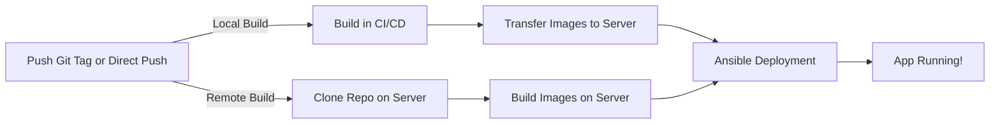

<div align="center">

# DevOps Deployment Framework


**Deploy your Docker apps with a simple `git push` (with or without tags)**

[](https://opensource.org/licenses/MIT)


</div>

---

## What is this?

A complete framework to **automate Docker deployments** from GitHub/GitLab CI/CD to your servers. 

Push a tag, grab a coffee, and your app is deployed.

> **Beta version** – Production-ready but actively improving. Your feedback is welcome!

### Key Features

- **Multi-environment**: Deploy to production, staging, whatever, etc.
- **Multi-host**: Deploy to multiple servers simultaneously
- **Multi-container**: Handle complex apps with multiple services
- **Secure**: SSH keys and secrets management built-in
- **Flexible builds**: Build in CI/CD or directly on your server
- **Customizable**: Nginx configs, systemd services, custom scripts

### Quick Start

```bash
# 1. Setup your server (one command!)
docker run -it --rm -v ${HOME}/.ssh:/root/.ssh -v .:/project shawiizz/devops-cli:latest

# 2. Copy example CI config to your repo
# 3. Add the needed ci secrets
# 4. Push a tag
git tag 1.0.0 && git push origin --tags
```

**That's it!**

---

## Table of Contents

- [How It Works](#how-it-works)
- [Installation](#installation)
- [Configuration](#configuration)
- [Deployment](#deployment)
- [Advanced Usage](#advanced-usage)
- [Examples](#real-world-examples)

---

## How It Works

### The Magic Behind the Scenes



### Deployment Triggers

| Tag Format | Environment | Example |
|------------|-------------|---------|
| `X.Y.Z` | production | `1.0.0` |
| `X.Y.Z-[env]` | custom | `1.0.0-whatever` |
| Branch push | production | Direct push to main |

### Compatible With

- ✅ GitHub Actions
- ✅ GitLab CI

---

## Installation

### Step 1: Server Setup

**Prerequisites:**
- A Debian/Ubuntu server
- Docker Desktop on your local machine

#### Automated Setup (Recommended)

```bash
docker run -it --rm -v ${HOME}/.ssh:/root/.ssh -v .:/project shawiizz/devops-cli:latest
```

The CLI will guide you through the setup process interactively.

<details>
<summary>Manual setup (advanced users)</summary>

For manual configuration, check [MANUAL-REMOTE-SETUP.md](./MANUAL-REMOTE-SETUP.md)

</details>

---

### Step 2: CI/CD Configuration

#### 2.1 Copy CI Config File

**GitHub Actions:**
```bash
example/ci/github-ci.yml → .github/workflows/deploy.yml
```

**GitLab CI:**
```bash
example/ci/gitlab-ci.yml → .gitlab-ci.yml
```

> ⚠️ **GitHub users in organizations**: Fork this repo and update the `uses` URL in your workflow file.

#### 2.2 Create Project Structure

```
.deployment/
├── docker/
│   ├── docker-compose.yml           # Define your services
│   └── Dockerfile.[service]         # One per service
└── env/
    └── .env.[environment]           # Environment variables
```

#### 2.3 Add Repository Secrets

Required secrets in your CI/CD settings:

| Secret Name | Description | Example |
|-------------|-------------|---------|
| `USER_PASSWORD` | Deployment user password | `your-password` |
| `[ENV]_SSH_PRIVATE_KEY` | SSH key per environment | `PRODUCTION_SSH_PRIVATE_KEY` |
| `GIT_TOKEN` | For private repos (remote build) | GitHub/GitLab token |

**Important notes:**
- ✅ All secret names must be **UPPERCASE**
- ✅ GitLab secrets must **NOT** be protected
- ✅ Main env file maps to `main` host automatically

<details>
<summary>Git Token Permissions (only for remote build with private repos)</summary>

- **GitHub**: `repo` scope (read access)
- **GitLab**: `read_repository` scope (or use built-in `CI_JOB_TOKEN`)

</details>

---

## Configuration

### Environment Files

Create `.deployment/env/.env.[environment]` with your variables:

```bash
# .env.production
HOST=192.168.1.10              # Server IP
USER=deploy                    # SSH user
DB_PASSWORD=$DB_SECRET         # Reference to CI secret
API_PORT=3000
```

**Pro tip:** Use `$VARIABLE_NAME` to reference CI secrets and keep sensitive data secure!

---

### Docker Compose File

Standard compose file with environment variables:

```yaml
services:
  app:
    image: my-app
    build:
      context: ../..
      dockerfile: .deployment/docker/Dockerfile.app
    ports:
      - "${APP_PORT}:3000"
    environment:
      DB_PASSWORD: ${DB_PASSWORD}
      ENV: ${ENV}
    networks:
      - app-network

networks:
  app-network:
```

#### Environment Isolation (Automatic)

By default, `${ENV}` and `${VERSION}` are automatically added to:
- Image names
- Container names
- Volume names
- Network names

This ensures **complete isolation** between environments (production, staging, etc.)

**No manual work needed!** The framework handles it transparently.

<details>
<summary>Manual environment isolation (advanced)</summary>

If you prefer manual control, create `.deployment/config.yml`:

```yaml
options:
  environmentize: false
```

Then manually add `${ENV}` and `${VERSION}` where needed:

```yaml
services:
  app:
    image: my-app-${ENV}:${VERSION}
    container_name: my-app-${ENV}
    volumes:
      - app-data-${ENV}:/data
    networks:
      - app-network-${ENV}
```

</details>

---

### Build Strategy

Choose how Docker images are built:

| Strategy | Where | Best For | Setup |
|----------|-------|----------|-------|
| **Local** (default) | CI/CD pipeline | Small images, fast network | Nothing to do |
| **Remote** | On server | Large images, slow network | Set `remote_build: true` |

#### Enable Remote Build

Create `.deployment/config.yml`:

```yaml
options:
  remote_build: true
```

**Benefits:**
- Faster deployments
- No CI/CD storage limits
- Reduced bandwidth usage

**Requirements:**
- Docker, Git on remote server
- `GIT_TOKEN` secret for private repos

---

### Multi-Host Deployment

Deploy to multiple servers in the same environment:

```
.deployment/env/
├── .env.production              # Main host
├── .env.production.server-a     # Server A
├── .env.production.server-b     # Server B
└── .env.production.server-c     # Server C
```

**Example:**

```bash
# .env.production (main)
HOST=192.168.1.10
API_PORT=3000
```

```bash
# .env.production.server-a
HOST=192.168.1.11
API_PORT=3001                    # Override
REDIS_URL=redis://server-a:6379 # Additional config
```

**SSH Keys:** `PRODUCTION_SSH_PRIVATE_KEY`, `PRODUCTION_SERVER_A_SSH_PRIVATE_KEY`, etc.

---

### Configuration File Options

Create `.deployment/config.yml` to customize behavior:

```yaml
options:
  environmentize: true          # Auto-add ENV/VERSION (default: true)
  enable_debug_logs: false      # Verbose logging (default: false)
  remote_build: false           # Build on server (default: false)
```

| Option | Description | Default |
|--------|-------------|---------|
| `environmentize` | Auto-add `${ENV}` and `${VERSION}` to names | `true` |
| `enable_debug_logs` | Enable detailed Ansible logs | `false` |
| `remote_build` | Build images on remote server | `false` |

---

### Advanced: Custom Templates

Add custom configs in `.deployment/templates/`:

```
.deployment/templates/
├── nginx/
│   └── my-app.conf.j2           # Custom Nginx config
├── services/
│   └── my-service.service.j2    # Systemd service
└── scripts/
    └── pre-deploy.sh.j2         # Custom script (executed before deploying)
```

All templates support **Jinja2 syntax** and have access to environment variables.

---

## Deployment

### Deploy with Git Tags

```bash
# Production deployment
git tag 1.0.0
git push origin --tags

# Staging deployment
git tag 1.0.0-staging
git push origin --tags

# Custom environment
git tag 1.0.0-whatever
git push origin --tags
```

### Deploy on Branch Push

You can also trigger deployments on direct branch pushes (deploys to `production`):

```bash
git push origin main
```

### What Happens During Deployment

1. **Build** - Docker images are built (locally or remotely)
2. **Transfer** - Images/code sent to target servers
3. **Deploy** - Ansible orchestrates the deployment
4. **Done** - Your app is live!

**CI/CD Jobs Available:**
- `build` - Validates Docker builds on every push
- `deploy` - Deploys when you push a tag

---

## Advanced Usage

### Custom Nginx Configuration

**Example:** Create `.deployment/templates/nginx/my-app.conf.j2`

```nginx
server {
    listen 80;
    server_name {{ lookup('env', 'DOMAIN') }};

    location / {
        proxy_pass http://localhost:{{ lookup('env', 'APP_PORT') }};
        proxy_set_header Host $host;
    }
}
```

---

### Custom Systemd Service

**Example:** Create `.deployment/templates/services/my-worker.service.j2`

```ini
[Unit]
Description={{ lookup('env', 'SERVICE_DESCRIPTION') }}
After=docker.service

[Service]
Type=simple
ExecStart={{ lookup('env', 'SCRIPT_PATH') }}
Environment="ENV={{ lookup('env', 'ENV') }}"
Restart=always

[Install]
WantedBy=multi-user.target
```

---

### Post-Deployment Scripts

**Example:** Create `.deployment/templates/scripts/cleanup.sh.j2`

```bash
#!/bin/bash
echo "Starting cleanup for {{ lookup('env', 'ENV') }}..."

# Clean old Docker images
docker image prune -af --filter "until=24h"

echo "Cleanup complete!"
```

All variables come from your `.env` files or CI/CD secrets and are available in templates using the `lookup('env', 'VARIABLE_NAME')` syntax.

---

## Real-World Examples

Check out the `example/.deployment/` folder for complete configuration examples.

### Projects Using This Framework

| Project | Description | Link |
|---------|-------------|------|
| **MohistMC Frontend** | React app with Nginx | [View](https://github.com/MohistMC/mohistmc-frontend) |
| **MohistMC Backend** | Spring Boot API | [View](https://github.com/MohistMC/mohistmc-backend) |
| **Maven Repository** | Maven registry server | [View](https://github.com/MohistMC/maven) |
| **Personal Website** | Portfolio site | [View](https://github.com/Shawiizz/shawiizz.dev) |

---

## Contributing

Want to improve this framework? **Contributions are welcome!**

Check out our [contribution guidelines](./CONTRIBUTE.md) to get started.

---

## License

This project is licensed under the **MIT License** - feel free to use it in your projects!

---

<div align="center">

### Built with ❤️ for the DevOps community

**Questions? Issues? Feedback?**  
Open an issue on GitHub - we're here to help!

**If this helped you, consider giving it a star!**

</div>