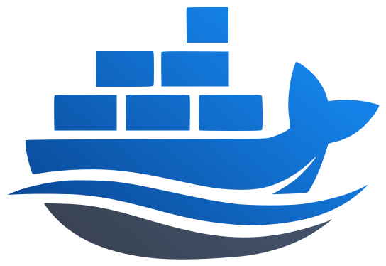

# Dockflow

**Deploy Docker apps to your own servers — Docker Swarm or k3s, via SSH.**

---

A CLI-first deployment framework for Docker applications. Supports Docker Swarm and k3s (Kubernetes) as orchestrators.

Dockflow automates the deployment of containerized applications to remote servers via direct SSH — no runtime dependencies beyond the binary itself. It handles image building, transfer, stack deployment, health monitoring, and automatic rollback.

## Documentation

Complete documentation is available at [dockflow.shawiizz.dev](https://dockflow.shawiizz.dev).

## License

MIT
