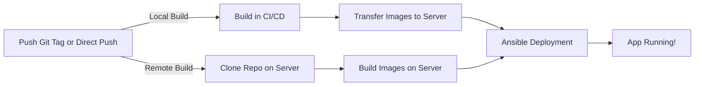

# Dockflow

**Deploy your Docker apps with a simple `git push` (with or without tags)**

Dockflow is a complete framework to **automate Docker deployments** from GitHub/GitLab CI/CD to your servers. Push a tag, grab a coffee, and your app is deployed.

> **Beta version** – Production-ready but actively improving. Your feedback is welcome!

## Key Features

- **Multi-environment**: Deploy to production, staging, whatever, etc.
- **Multi-host**: Deploy to multiple servers simultaneously
- **Multi-container**: Handle complex apps with multiple services
- **Secure**: SSH keys and secrets management built-in
- **Flexible builds**: Build in CI/CD or directly on your server
- **Customizable**: Nginx configs, systemd services, custom scripts

## How It Works

### The Magic Behind the Scenes

### Deployment Triggers

| Tag Format | Environment | Example |
|------------|-------------|---------|
| `X.Y.Z` | production | `1.0.0` |
| `X.Y.Z-[env]` | custom | `1.0.0-whatever` |
| Branch push | production | Direct push to main |

### Compatible With

- ✅ GitHub Actions
- ✅ GitLab CI
